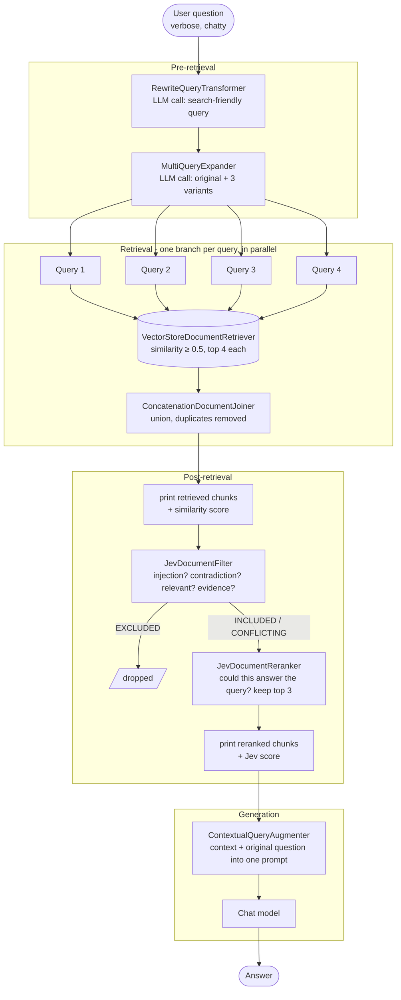

# 05-1 Modular RAG

The [05-rag](../05-rag) demo answers a question about Hurricane Milton with a single `QuestionAnswerAdvisor`:
embed the question, fetch similar chunks, stuff them into the prompt.

This demo answers the same kind of question through Spring AI's
[Modular RAG](https://docs.spring.io/spring-ai/reference/api/retrieval-augmented-generation.html) support
(`spring-ai-rag`). The `RetrievalAugmentationAdvisor` runs a pipeline where every stage is a pluggable
building block, following the paper
[Modular RAG: Transforming RAG Systems into LEGO-like Reconfigurable Frameworks](https://arxiv.org/abs/2407.21059).

## Pipeline used in this demo

| Phase | Component | What it does here |
|---|---|---|
| Pre-retrieval | `RewriteQueryTransformer` | Turns the verbose, chatty user question into a search-friendly query (LLM call) |
| Pre-retrieval | `MultiQueryExpander` | Expands that query into 3 semantically diverse variants plus the original (LLM call) |
| Retrieval | `VectorStoreDocumentRetriever` | Similarity search per query, top 4 above a 0.5 threshold; the default `ConcatenationDocumentJoiner` dedups the union |
| Post-retrieval | lambda `DocumentPostProcessor` | Prints each chunk's similarity score and a snippet (used before and after the Jev stages) |
| Post-retrieval | `JevDocumentFilter` | TypeSafe Jev screening: drops injected or irrelevant passages (see below) |
| Post-retrieval | `JevDocumentReranker` | TypeSafe Jev reranking by "could this passage answer the query?", keeps the top 3 |
| Generation | `ContextualQueryAugmenter` | Stuffs the context into the prompt; `allowEmptyContext(true)` lets the model answer even with no hits |

### Flow

What `RetrievalAugmentationAdvisor` does for one `chatClient.prompt().user(...).call()`:



Pre-retrieval stages receive the query as the user typed it. The retrieval branches fan out on the advisor's
`TaskExecutor` and are joined before post-processing. Note that the post-processors and the augmenter work on
the *original* question, not the rewritten one, which is why the final answer still addresses the user's phrasing.

Everything lives in [DemoApplication.java](src/main/java/com/example/demo/DemoApplication.java).
The small `logging(...)` wrapper around the retriever prints every query that reaches the vector store,
so you can see the rewrite and expansion stages at work.

The LLM-backed stages get their own cloned `ChatClient.Builder` so they do not inherit the main client's
advisors. The Spring AI docs recommend a low temperature for these stages; it is omitted here because the
Claude model used in this demo no longer accepts the `temperature` option.

## Prerequisites

- Java 17+ and Maven
- `ANTHROPIC_API_KEY` for the Claude chat model
- `TYPESAFE_API_KEY` for the Jev post-retrieval stages (the app fails fast at startup without it)
- Embeddings run locally through the transformers starter (ONNX model downloaded on first run)

## Running

```bash
mvn -pl 05-1-modular-rag spring-boot:run
```

Expected console output, in order:

1. `[retrieve] ...` lines: the rewritten question and its expanded variants (interleaved, retrieval runs in parallel)
2. `[retrieved] <similarity> <snippet>...` lines, one per chunk the joiner produced
3. `[jev-reranked] <jev score> <snippet>...` lines, the top 3 after Jev screening and reranking
4. The `MyLoggingAdvisor` dump of the augmented user prompt
5. The final answer

The advisor runs the per-query retrievals in parallel. The demo passes it Spring Boot's auto-configured
`TaskExecutor` (virtual threads, see `spring.threads.virtual.enabled`) because the advisor's own default
pool uses non-daemon threads that would keep this command-line app running after the answer is printed.

## Jev screening and reranking

[Spring AI TypeSafe](https://spring-ai-community.github.io/spring-ai-typesafe/) ships two extra
`DocumentPostProcessor`s backed by TypeSafe's Jev model, a small classifier that answers yes/no questions
about a query and a passage with a calibrated score:

| Component | What it does |
|---|---|
| [JevDocumentFilter](https://spring-ai-community.github.io/spring-ai-typesafe/latest/rag/JevDocumentFilter/) | Asks four questions per passage (prompt injection, contradicts the query's premise, relevant, contains answer evidence) and drops injected or irrelevant passages. Contradicting passages are kept and tagged in metadata. |
| [JevDocumentReranker](https://spring-ai-community.github.io/spring-ai-typesafe/latest/rag/JevDocumentReranker/) | Asks "could this passage answer the query?" per passage, sorts by that score (stored under `jev.rerank.score`) and keeps the top K. |

The `spring-ai-starter-typesafe` auto-configures the `TypeSafeClient` from `spring.ai.typesafe.api-key`,
which [application.properties](src/main/resources/application.properties) reads from `TYPESAFE_API_KEY`
(add it to the repo-root `.env` or export it). The demo injects that client and passes it to both builders.

Both components fail open: if the Jev API is unreachable the passages pass through unscreened or unscored
and a warning is logged, so a bad key degrades to plain modular RAG rather than breaking the demo.

The two artifacts (`spring-ai-starter-typesafe`, `typesafe-spring-ai`) come from Maven Central, version
`0.3.0`, set by the `spring-ai-typesafe.version` property in the root pom.

## Compared with 05-rag

The ingestion code is identical. The only change is `QuestionAnswerAdvisor` becoming a
`RetrievalAugmentationAdvisor` with explicit, swappable stages. Any stage can be replaced with your own
implementation of `QueryTransformer`, `QueryExpander`, `DocumentRetriever`, `DocumentJoiner`,
`DocumentPostProcessor` or `QueryAugmenter`. The Jev stages are an example of dropping in
third-party post-processors without touching the rest of the pipeline.
